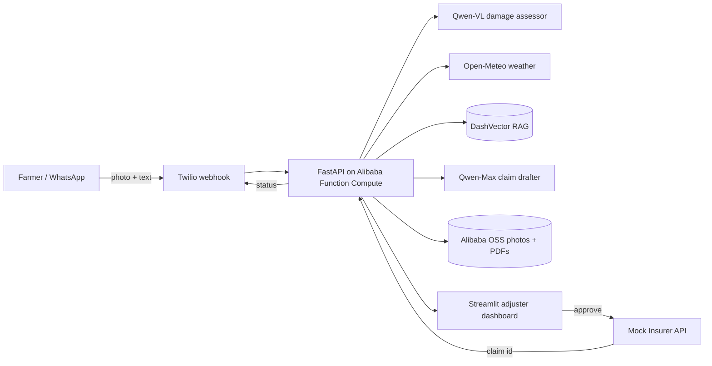

# ClaimFarm

> An AI agent that turns a smallholder farmer's WhatsApp photo of damaged crops into a filed insurance claim in under 60 seconds.

[](LICENSE)
[](https://www.python.org/downloads/)
[](https://www.qwencloud.com/)
[](https://www.alibabacloud.com/)

Submitted to the **Global AI Hackathon Series with Qwen Cloud** — Track 4: Autopilot Agent.

**Live backend:** https://claimfarm-api-wovsxktpbk.ap-southeast-1.fcapp.run (Function Compute 3.0, Singapore region) · `/healthz` · `/docs`

## Why

~500 million smallholder farmers globally lose crops to weather and pests every year. Less than 20% of those eligible ever file an insurance claim, because the forms are in the wrong language, demand structured evidence they cannot easily produce, and assume domain literacy. ClaimFarm collapses that workflow to one photo.

## What it does

1. Farmer sends a damaged-crop photo (and optionally a few words in any language) to a WhatsApp number.
2. **Qwen-VL-Max** assesses the photo and returns structured damage: crop type, damage cause, severity, affected area, confidence.
3. **Open-Meteo** historical weather is cross-referenced against the farmer's location and date to corroborate the diagnosis.
4. **Qwen embeddings + Alibaba DashVector** retrieve similar past claims, relevant agronomy guides, and possible fraud patterns.
5. **Qwen-Max** drafts a pre-filled claim PDF (WeasyPrint).
6. The claim lands in an adjuster's Streamlit dashboard for human review and approval.
7. On approval, the claim is submitted to a mock insurer API; the farmer is notified in their own language.

## Architecture

See [`docs/architecture.md`](docs/architecture.md) for the full diagram.



## Tech stack

| Layer | Choice |
|---|---|
| Language | Python 3.11 |
| Backend | FastAPI |
| Adjuster UI | Streamlit |
| Vision | Qwen-VL-Max via Qwen Cloud |
| Reasoning | Qwen-Max via Qwen Cloud |
| Embeddings | Qwen text-embedding-v3 |
| Vector DB | Alibaba DashVector |
| File storage | Alibaba OSS |
| Relational | SQLite (dev) → Alibaba Tablestore (prod) |
| Farmer interface | Twilio WhatsApp Sandbox |
| Weather | Open-Meteo |
| PDF | WeasyPrint |
| Deployment | Alibaba Function Compute + API Gateway |

## Repo layout

```
claimfarm/
├── app/                  # FastAPI orchestrator + agent modules
│   ├── agents/           # Damage assessor, claim drafter, multilingual replier
│   ├── clients/          # Qwen, OSS, DashVector, Twilio, Open-Meteo wrappers
│   ├── models/           # Pydantic schemas
│   └── storage/          # SQLite + DashVector repositories
├── dashboard/            # Streamlit adjuster review UI
├── mock_insurer/         # Stand-in insurer REST API
├── scripts/              # Seed agronomy KB, run eval set
├── tests/
├── docs/
│   ├── architecture.md
│   └── alibaba-cloud-proof.md
└── data/                 # Sample photos, agronomy corpus (gitignored where large)
```

## Local setup

```bash
# 1. clone
git clone https://github.com/hemnaath04/claimfarm.git
cd claimfarm

# 2. install deps
uv sync

# 3. configure
cp .env.example .env
# fill in QWEN_API_KEY, ALIBABA_* keys, TWILIO_* keys

# 4. run backend
uv run uvicorn app.main:app --reload

# 5. run adjuster dashboard
uv run streamlit run dashboard/app.py

# 6. run mock insurer (separate terminal)
uv run uvicorn mock_insurer.main:app --port 8001 --reload
```

## Hackathon submission artifacts

- **Proof of Alibaba Cloud deployment**: [`docs/alibaba-cloud-proof.md`](docs/alibaba-cloud-proof.md) + [`app/clients/alibaba_oss.py`](app/clients/alibaba_oss.py)
- **Architecture diagram**: [`docs/architecture.md`](docs/architecture.md)
- **Demo video**: *(link added at submission)*
- **Track**: 4 — Autopilot Agent

## License

[MIT](LICENSE)
