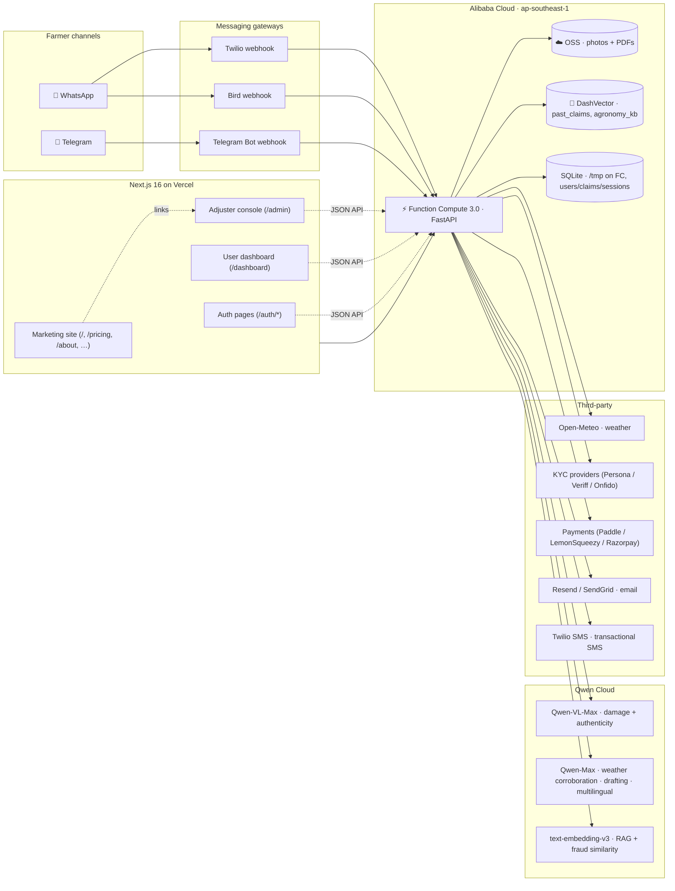

# ClaimFarm — Architecture

> An autopilot agent that turns a smallholder farmer's WhatsApp / Telegram photo into a filed crop-insurance claim. This document is the source of truth for the system's shape, the components, and the data flow end-to-end.

## System map



## Process boundaries

| Process | What it owns | Where it runs |
|---|---|---|
| **FastAPI orchestrator** (`app/`) | Channel webhooks, AI orchestration, claim persistence, JSON API, auth, identity, admin, billing | Alibaba Function Compute 3.0, custom container |
| **mock_insurer** (`mock_insurer/`) | Stand-in insurer carrier (POST /claims, GET status). Mounted at `/insurer` on the main FastAPI | Same container |
| **Next.js dashboard** (`web/`) | Marketing site + adjuster console + user dashboard | Vercel (claimfarm-dashboard.vercel.app) |
| **Streamlit fallback** (`dashboard/main.py`) | Original adjuster UI; retained for offline demos | Local only |

## Request flow — first claim from photo to filed PDF

1. **Inbound.** Farmer sends a photo to the Telegram bot (or Twilio/Bird WhatsApp number). The gateway's webhook POSTs to `/telegram/inbound` (or `/twilio/inbound`, `/bird/inbound`) on the FastAPI app.
2. **Forensics** (`app/agents/photo_forensics.py`). EXIF capture time, GPS, camera, edit-software flags are pulled with Pillow. Qwen-VL runs an authenticity prompt (watermark / screenshot / AI-generation detection). Result: a `PhotoForensics` record.
3. **Vision** (`app/agents/damage_assessor.py`). Qwen-VL-Max returns a `DamageAssessment` JSON: crop, damage_cause, severity, affected_area, confidence, visible_indicators, notes.
4. **Weather corroboration** (`app/agents/weather_corroborator.py`). Open-Meteo historical archive is queried using the photo's GPS (EXIF) or the farmer's saved location, ending on the photo's capture date. The 30-day aggregate plus the visual verdict are sent to Qwen-Max which returns a `CorroborationResult` (corroborated, strength, evidence, flags).
5. **Retrieval** (`app/agents/past_claim_rag.py`, `app/agents/agronomy_rag.py`). The claim text is embedded with `text-embedding-v3` and queried against DashVector — top-K similar past claims surface for the adjuster, agronomy snippets ground the diagnosis.
6. **Fraud check** (`app/agents/fraud_check.py`, `app/clients/perceptual_hash.py`). Same-farmer near-duplicates at cosine similarity ≥ 0.93 get a `[block]` flag; cross-farmer narrative reuse at ≥ 0.97 gets `[warn]`. The perceptual-hash module also flags duplicate image bytes.
7. **Draft** (`app/agents/claim_drafter.py`). A `Claim` is assembled with a heuristic loss estimate. WeasyPrint renders an A4 PDF from a Jinja template, uploaded to `oss://claimfarm-files/claims/{claim_id}.pdf` via the `alibaba_oss` client.
8. **Review.** Claim lands in the adjuster console with photo, AI assessment, weather evidence, similar past claims, fraud flags, forensics, and a localized farmer-message preview.
9. **Submit.** On approval the orchestrator POSTs to the mock `/insurer/claims` endpoint, which returns a probabilistic decision. Status hops `pending_review → submitted → approved/rejected → paid`.
10. **Notify.** Qwen-Max localizes a short status message into the farmer's detected language (10+) and the channel client (Telegram / Twilio / Bird) delivers it back to the farmer.

## Authentication + identity

```
   Browser ── POST /auth/sign-up ──▶ FastAPI
                                    │
                                    ├── users_repo (SQLModel)
                                    ├── tokens.create_session() → cf_session cookie
                                    └── notifications.send(kind="welcome")

   Browser ── POST /api/identity/start ──▶ IdentityProvider
                                          │
                                          └── MockProvider | Persona | Veriff | Onfido
                                                             │
                                                             └── audit("identity.session_started")
```

- **Sessions**: opaque random tokens, stored in `auth_sessions` table, 30-day refresh window. HTTP-only cookies, `SameSite=Lax`, `Secure` when `PUBLIC_BASE_URL` is HTTPS.
- **Passwords**: PBKDF2-HMAC-SHA256, 600k iterations (OWASP 2023). Upgradable to Argon2id by swapping the `app.auth.passwords` module.
- **CSRF**: relies on `SameSite=Lax` + JSON-only mutating endpoints. Forms posting cross-origin should add a double-submit cookie.
- **RBAC**: 5-level hierarchy — `owner > admin > moderator > reviewer > farmer`. First user in an org is auto-`owner`.
- **Audit log**: JSONL at `/tmp/claimfarm_audit.jsonl`; production moves this to Tablestore. Every state-changing call records actor + action + target + structured metadata.

## Storage layout

| Store | What | Notes |
|---|---|---|
| **Alibaba OSS** (`claimfarm-files`) | Farmer photos, generated claim PDFs, identity documents (separate prefix, stricter ACL) | Signed-URL access; server-side encryption; lifecycle policy keeps insurance evidence 7 years, identity 5 years post-account-closure |
| **Alibaba DashVector** (`claimfarm` cluster) | `past_claims` + `agronomy_kb` collections, 1024-dim float, cosine | Persistent; survives FC cold starts |
| **SQLite** (`/tmp` on FC; `~/projects/claimfarm/claimfarm.sqlite` in dev) | Users, sessions, one-time tokens, claims, audit log staging | Production swaps to **Alibaba Tablestore** by changing `DATABASE_URL` and shipping a thin adapter (TODO) |

## Cross-cutting concerns

- **Rate limiting** (`app/middlewares.py:IPRateLimiter`) — 60 req/IP/min on `/api/*` and `/auth/*`. In production, fronted by Vercel Edge / Cloudflare WAF for distributed limits.
- **Security headers** (`app/middlewares.py:SecurityHeaders`) — `X-Frame-Options: DENY`, `nosniff`, `Referrer-Policy: no-referrer`, default CSP that locks down frame-ancestors and inline-script origins.
- **Cache control** — `/api/*` responses set `Cache-Control: no-store` so CDNs (Vercel, Cloudflare) don't serve stale JSON across viewers.
- **Idempotency** — webhook handlers de-dupe by message ID where the provider supplies one; claims and one-time tokens are intrinsically unique.

## Why this hits the Track 4 brief

| Track 4 ask | How ClaimFarm answers it |
|---|---|
| Ambiguous inputs | A photo + a voice memo in Hindi, no structured form |
| External tool invocation | Qwen-VL, Open-Meteo, DashVector, OSS, Insurer API, Twilio/Bird/Telegram, KYC provider, payments provider |
| Human-in-the-loop checkpoint | Streamlit + Next.js adjuster review — approve / reject / request-more-info gates the insurer submission |
| Production readiness | Three Alibaba Cloud services in production, structured pydantic schemas at every hop, deterministic loss math, RAG-grounded reasoning, fraud detection, multilingual replies, RBAC, audit log, signed-URL storage, rate limiting, security headers, dual UIs |

## Qwen Cloud capability inventory

This project exercises **three** distinct Qwen Cloud capabilities (Innovation rubric, 30%):

- **Vision** — `qwen-vl-max` for multimodal crop-damage assessment with structured-JSON output, and photo-authenticity verdicts
- **Reasoning** — `qwen-max` for weather corroboration, claim drafting, multilingual rewrites, language detection
- **Embeddings** — `text-embedding-v3` (1024-dim) feeding DashVector for past-claim retrieval, agronomy grounding, fraud detection
