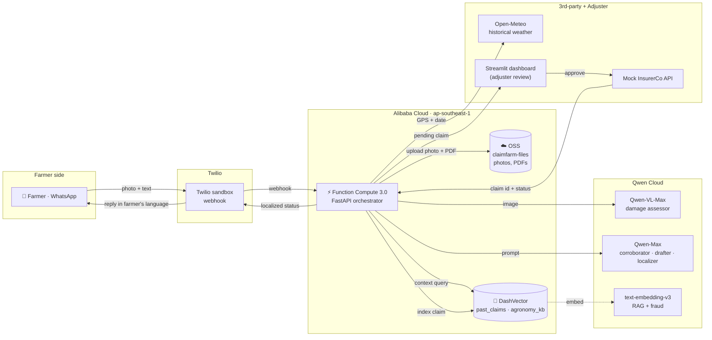

# ClaimFarm — Architecture

> An autopilot agent that turns a smallholder farmer's WhatsApp photo into a filed crop-insurance claim. Every component below is either a Qwen Cloud capability, an Alibaba Cloud service, or a thin orchestrator written in Python.

## System diagram



## Request flow — first claim from photo to filed PDF

1. **Inbound.** Farmer sends a photo (and optional voice/text) to the Twilio WhatsApp sandbox. Twilio POSTs to the FastAPI `/twilio/inbound` route running on Alibaba Function Compute.
2. **Vision.** The photo bytes are forwarded to Qwen-VL-Max via the OpenAI-compatible DashScope endpoint. Output is a structured `DamageAssessment` (crop, cause, severity, affected-area %, confidence, visible indicators).
3. **Weather corroboration.** GPS + claim date are passed to Open-Meteo's archive API. The 30-day aggregate (precip, hot days, dry-day runs, frost days) plus the visual verdict are sent to Qwen-Max, which returns a `CorroborationResult` (corroborated bool, strength, evidence, flags).
4. **Retrieval.** A short text representation of the claim is embedded with `text-embedding-v3` and queried against DashVector:
   - `agronomy_kb` (15 seeded snippets) — grounds the damage diagnosis
   - `past_claims` (auto-indexed on every save) — gives the adjuster precedent + powers fraud detection
5. **Fraud check.** Same-farmer claims at cosine similarity ≥ 0.93 raise a `[block]` flag; cross-farmer narrative reuse at ≥ 0.97 raises `[warn]`.
6. **Draft.** A `Claim` is assembled with a heuristic loss estimate (`farm_area × yield_per_ha × severity × affected_area`). WeasyPrint renders an A4 PDF from a Jinja template, uploaded to `oss://claimfarm-files/claims/{claim_id}.pdf`.
7. **Review.** The claim lands in the Streamlit adjuster dashboard with photo, AI assessment, weather evidence, similar past claims, fraud flags, and a localized farmer-message preview.
8. **Submit.** On approval the orchestrator POSTs to the mock InsurerCo API, which returns a probabilistic decision (approved / needs_more_info / rejected) and a payout amount. The Claim status hops `pending_review → submitted → approved/rejected → paid`.
9. **Notify.** Qwen-Max localizes a short status message into the farmer's detected language (10 supported) and Twilio delivers it as a WhatsApp reply.

## Data stores

| Store | What lives there | Notes |
|---|---|---|
| **Alibaba OSS** (`claimfarm-files`) | Farmer photos, generated claim PDFs | Private bucket; objects exposed to the dashboard via signed URLs |
| **Alibaba DashVector** (`claimfarm`) | Two collections, 1024-dim float, cosine | `past_claims` auto-indexed on save; `agronomy_kb` seeded once |
| **SQLite** (`/tmp/claimfarm.sqlite` in FC) | Relational state: claims, status, adjuster notes | Hot fields denormalized for query; full Claim stored as JSON. Production swap path: Alibaba Tablestore. |

## Why this hits the Track 4 brief

| Track 4 ask | How ClaimFarm answers it |
|---|---|
| Ambiguous inputs | A photo + a voice memo in Hindi, no structured form |
| External tool invocation | Qwen-VL, Open-Meteo, DashVector, OSS, Insurer API, Twilio |
| Human-in-the-loop checkpoint | Streamlit adjuster review — approve / reject / request-more-info gates the insurer submission |
| Production readiness | Three Alibaba Cloud services in production, structured pydantic schemas at every hop, deterministic loss math, RAG-grounded reasoning, fraud detection, multilingual replies |

## Qwen Cloud capability inventory

This project exercises **three** distinct Qwen Cloud capabilities, which directly addresses the Innovation & AI Creativity rubric (30%):

- **Vision** — `qwen-vl-max` for multimodal crop-damage assessment with structured-JSON output
- **Reasoning** — `qwen-max` for weather corroboration, claim drafting, and multilingual rewrites
- **Embeddings** — `text-embedding-v3` (1024-dim) feeding DashVector for past-claim retrieval, agronomy grounding, and fraud detection

## Repo layout

```
claimfarm/
├── app/
│   ├── agents/        # damage_assessor, weather_corroborator, claim_drafter,
│   │                  # past_claim_rag, agronomy_rag, fraud_check, multilingual
│   ├── clients/       # qwen, weather, vector_store, embeddings, alibaba_oss, insurer
│   ├── models/        # pydantic schemas (damage, weather, claim)
│   └── storage/       # SQLite repo + ClaimRow schema
├── dashboard/         # Streamlit adjuster UI
├── mock_insurer/      # FastAPI stand-in carrier
├── scripts/           # seed_agronomy_kb, seed_demo_claim, reindex_claims, test_*
├── deploy/            # Dockerfile is at repo root; deploy/README.md describes ACR + FC steps
└── docs/              # architecture.md (this file) + alibaba-cloud-proof.md
```
