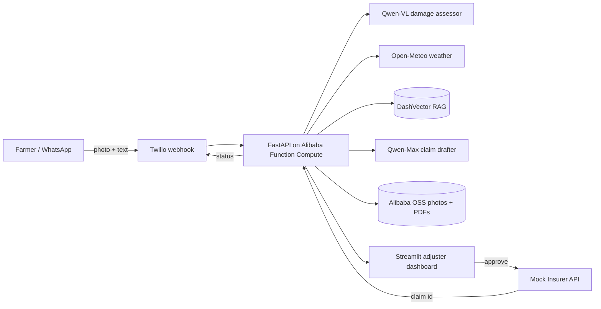

# Architecture

> Drawn out in Task #12. This file currently mirrors the high-level diagram in the README.

```mermaid
flowchart LR
  F[Farmer / WhatsApp] -->|photo + text| T[Twilio webhook]
  T --> A[FastAPI on Alibaba Function Compute]
  A --> VL[Qwen-VL damage assessor]
  A --> W[Open-Meteo weather]
  A --> V[(DashVector RAG)]
  A --> M[Qwen-Max claim drafter]
  A --> O[(Alibaba OSS photos + PDFs)]
  A --> D[Streamlit adjuster dashboard]
  D -->|approve| I[Mock Insurer API]
  I -->|claim id| A
  A -->|status| T
```
